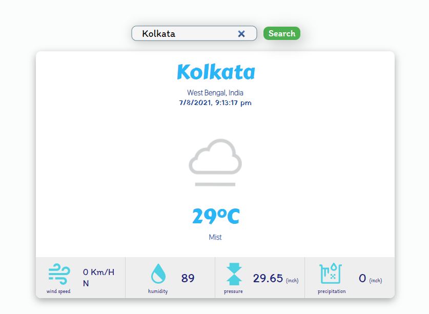

# Weather App

This is `Weather App`. You can get current the weather of any places, situated in any corner of world. You can also get the exact time of that place in the Indian Time format.

## Api

The `api` which is used in this app is [Weather Api](https://www.weatherapi.com/).

## `Technology`

The main technology that is used in this app is [React JS](https://reactjs.org/), that is a JavaScript Library  & [SCSS](https://sass-lang.com/). Above all, `HTML`, `CSS`, `npm` is used also. The icons of this app, are taken from [Iconify](https://iconify.design/).

## `Specification`

### `Current Weather`

You can get the current weather of any place. All of the vital data of weather like `Temperature`, `Humidity`, `Wind Speed` etc. are available here.

### `Current Time`

You can get the current time of any place. The time is in Indian date-time format.